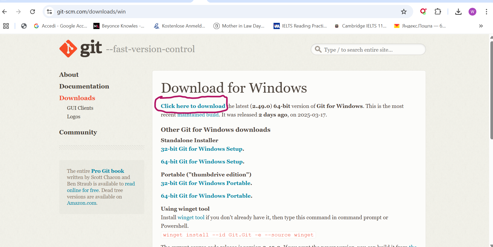
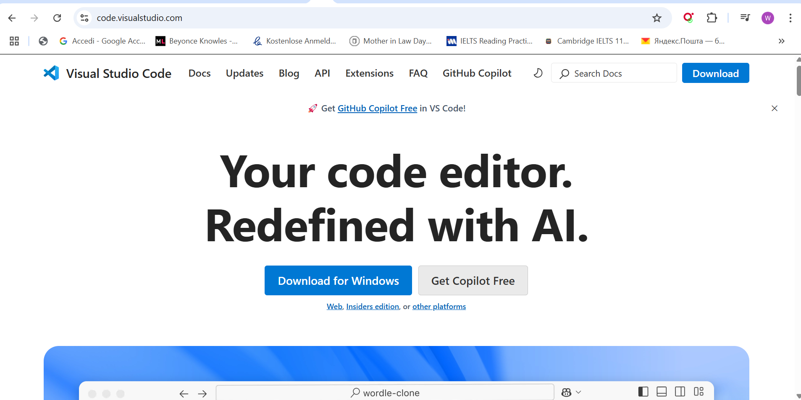
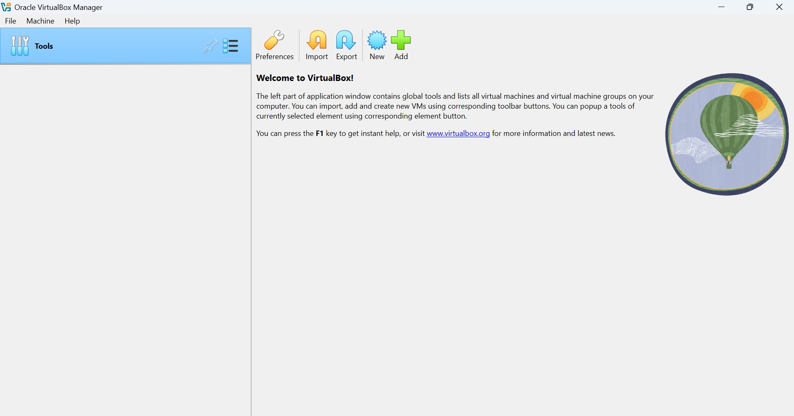
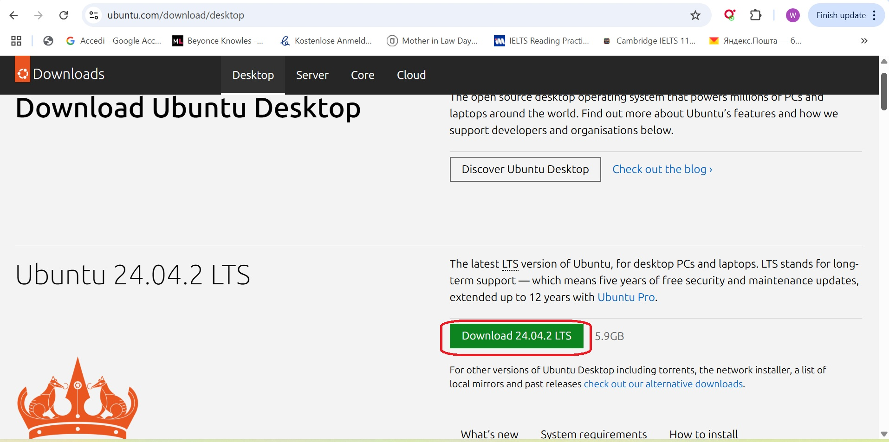
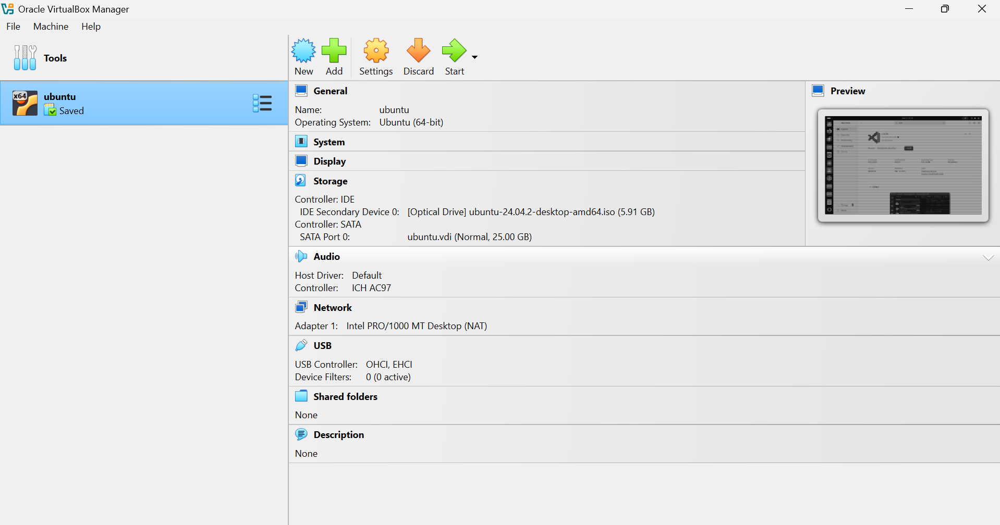

# Tech Environment Setup

This document outlines the step-by-step process of setting up my tech environment by installing essential tools and creating necessary accounts for my tech journey.

## Tools and Accounts Needed
1. [Tools Installation](#tools-installation)
    - [Git](#git)
    - [Visual Studio Code (VS Code)](#vs-code)
    - [VirtualBox](#virtualbox)
    - [Ubuntu on VirtualBox](#ubuntu-on-virtualbox)
2. [Account Creation](#account-creation)
    - [GitHub Account](#github-account)
    - [Amazon Web Services (AWS) Account](#aws-account)
3. [Conclusion](#conclusion)

---

## Tools Installation

>### Git

**Step 1:** I downloaded the Git installer for Windows from the [official Git website](https://git-scm.com/). 



**Step 2:** Run the installer and follow the on-screen instructions. 

- During installation, I double-clicked to run the exe file and left all options to  default since i have no specific preferences.  
- But i ensured that i selected "Git from the command line and also from 3rd-party software" when prompted. 
- Lastly, I clicked  *install* to complete the installation. Followed by *FINISH* to complete the process

**Step 3:** Verifying the installation by opening a terminal (Command Prompt):

- I opened a command prompt terminal to confirmed my installation by executing the cammand "*git --version*" as shown on the screenshot below.
```bash
git --version
````


---

> ### VScode

**Step 1:** I downloaded the VScode installer from the [official VScode website](https://code.visualstudio.com/).


- On the web page above, i clicked *"Download for Windows,"* since i was using a windows system to download VScode.

**Step 2:** Run the installer and follow the on-screen instructions.
- I navigated to downloads to locate the downloaded .exe file and double-clicked the installer.
- I then clicked through the installation wizard and prompt.
- Lastly, i clinked *INSTALL*, followed by *FINISH* to complete the installation.

**Step 3:** Verifying the installation through the Start Menu:  

- I lunched VScode through the start menu.Since the insallation was successful, see below what it look like below. 


---


>### Virtual Box (Windows)

**Step 1:** I downloaded virtual-box from it's [official website](https://www.virtualbox.org/wiki/Downloads)

- On the thier page, i clicked *DOWNLOADS* and selected the *windows hosts* version.

.jpg)

**Step 2:** Run the installer and follow the on-screen instructions.

- After downloading the exe file, i double-clicked to run the installer and clicked *NEXT* through the installation wizard and prompt, leaving all the option to *default*.
- Lastly, i clicked *INSTALL* to complete the installation and *FINISH* to complete the process.

**Step 3:** Verify the installation by lunching virtual box using the start menu:

- Since the installation was successful, kindly see below what it look like.



___


> ### Ubuntu on Virboxbox (Windows)

**Step 1:** I downloaded ubuntu from it's [official website](https://ubuntu.com/download/desktop)

- I downloaded the windows version by first clicking *Desktop*, followed by *Download 24.04.2 LTS* to download the ubuntu.Ios file. 




**Step 2:** I lunched my already installed virtual box.

- To create a new *VM*, i clicked on the *New* symbol at the top of the virtual box windows.
- I configured the *VM* by doing the following below.


```Vm configuration
- I named my VM "Ubuntu"
- Set the type to "linux" and version to Ubuntu (64-bit)
- Allocted 4GB of RAM and 25GB of disk space to my VM.
- Selected the ubuntu ISO file at the bootable disk.
```


- I lunched the virtual machine to start the ubuntu installation process.
- I follow through the on screen prompt, configuring the language,user name,password and keyboard etc. to complete the ubuntu installation.
- Once installation was completed, i login to my ubuntu virtual machine as seen below.


___
## Account Creation


> ### GitHub Account

**Step 1:** To create a GitHub account, i went to GitHub [Official website](https://github.com/login)

- On GitHub webpage, i clicked *"Create an account"* to start the account creation.


- On the Github Creation page, I filled in details like *"Username, Email and Password"* and then clicked "*Continue*" to continue with the account creation


- On the next webpage, i verifyed the account by solving a puzzle and also entered a confirmation code sent to my email.

- After verifying the account, the account was successfully created as seen below.


- To confirm account creation, i entered my email and password.


> ### Amazon Web Services (AWS) Account Creation

- **Step 1:** To create a AWS account, i went to AWS free tier page 

- I clicked on *"Create a free Account"* and provided details like *"email, account name and password"* 

-  I Provided my payment details  for the account verification, as well as Verifyed my identity by entering a code sent to my email.

- After all the process above, my AWS account was successfully created.


---
## Conclusion
This setup process has equipped me with the necessary tools and accounts to begin my tech journey. 

I now have:

- **Git** for version control.

- **VSCode** as my code editor.

- **VirtualBox and Ubuntu** for virtualization and Linux development.

- **GitHub** for code hosting and collaboration.

- **AWS** for cloud computing and deployment.

```
I will continue to update this document as I install more tools and create additional accounts.

